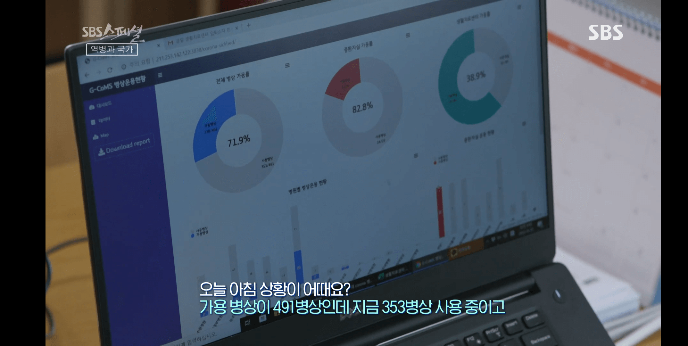
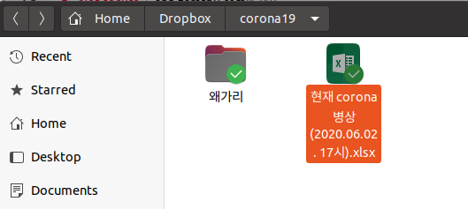

```{r setup, include=FALSE}
options(htmltools.dir.version = FALSE)
knitr::opts_chunk$set(echo = T, fig.align = "center", warning = F, message = F)
library(knitr);library(DT);library(rmarkdown)
```


layout: true

<div class="my-footer"><span><a href="https://www.zarathu.com">Zarathu Co.,Ltd</a>   
&emsp;&emsp;&emsp;&emsp;&emsp;&emsp;&emsp;&emsp;&emsp;&emsp;&emsp;&emsp;&emsp;
&emsp;&emsp;&emsp;&emsp;&emsp;&emsp;&emsp;&emsp;&emsp;&emsp;&emsp;&emsp;&emsp;
<a href="https://github.com/jinseob2kim">김진섭</a></span></div> 


---

# Executive Summary 

.large[

연구용역기간 2020.03.01 ~ 2020.05.11 에 


* [병상관리 대시보드](https://github.com/shinykorea/corona-sickbed)


* [확진자 건강관리 대시보드](https://github.com/shinykorea/corona-triage)


를 개발완료하였음을 보고합니다.
]

---

# 회사 소개

.large[
맞춤형 의학통계지원을 업으로 하는 2년차 법인.

- 의학연구자들에게 맞춤형 통계웹 제공.

- 범용 통계웹 운영: http://app.zarathu.com

]

주요 프로젝트 

- **대한심혈관중재학회** COBIS3 레지스트리 위탁분석 

- **서울성모병원** COREA-AMI 레지스트리 위탁분석 

- **삼성서울병원** 공통데이터모델(CDM) 분석 

- **강동성심병원** 공통데이터모델(CDM) 및 공공빅데이터 분석

- **대한이식학회** 신장이식환자 및 육종데이터 위탁분석

---
# 대표이력 

.large[
[김진섭](https://github.com/jinseob2kim)

- 성균관의대 졸업

- 예방의학 전문의, 보건학 박사수료 (서울대 보건대학원)

- 소프트웨어 엔지니어, 삼성전자 무선사업부

- R 패키지 개발자

]

---

# 공동개발자

.large[

[Shinykorea](https://github.com/shinykorea/Meetup) 밋업 멤버들의 도움

- [김진환](https://github.com/jhk0530): UNIST 박사과정, 확진자 건강관리 주개발

- [나영준](https://github.com/youngjunna): 건국대 연구교수, 병상관리 주개발

- [탁온식](https://github.com/takos1026) : 다윈스 대표, 구글설문지 주개발

- [이진호](https://github.com/jinholeetopology): 서버구축 및 관리
]


---
# 고려사항 

.large[

- 웹에서 실시간으로 R 코드가 실행되는 컨셉 

- 보안: 로그인, Dropbox/구글시트 접근권한

- 이용자 의견 반영한 색상, 그래프, 테이블

- 경기도 색상과 폰트 적용

- 리포트 다운기능: pdf/word 각각

]

---
# 개발 1: 병상관리 대시보드



---
# 병상관리 대시보드 요약

.large[

- 목표: 경기도 병원 및 생활치료센터의 가용병상 현황을 보여주는 대시보드를 개발, 중증환자 입원에 대한 긴급대책단의 의사결정을 돕는다.

- 정부제공 서버에 배포 중

- 주요 기능: **로그인, Dropbox 연계 엑셀파일 업데이트, 병상현황 그래프/지도, 리포트 다운로드(pdf/word)**

]



---
# 개발 2: 확진자 건강관리


---


---
# 확진자 건강관리 요약 

.large[
- 목표: Covid-19 확진자를 중증도에 따라 분류, 의료자원을 고려한 치료 전략에 도움을 준다.

- 현재 정부지원 서버에 배포 중

- 주요 기능: **로그인, 구글 시트 연계 엑셀파일 업데이트, 구글 설문지 동기화, 전체 환자/센터별/개인별 상세 정보, 그래프**
]
---

class: center, middle

# END


